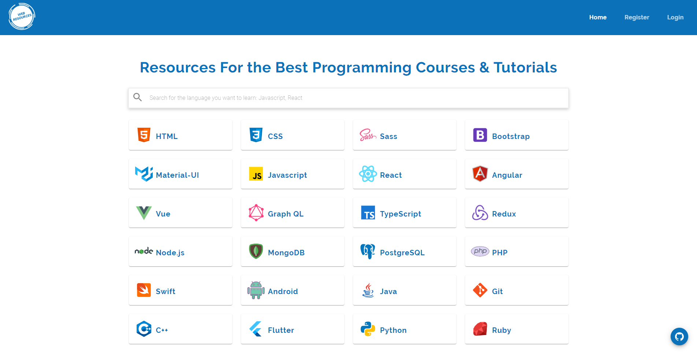
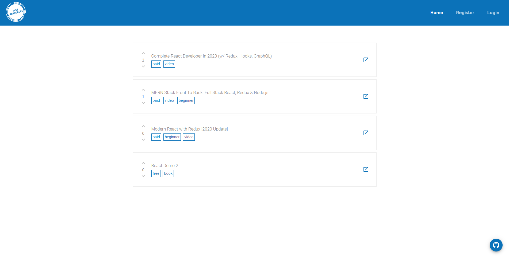
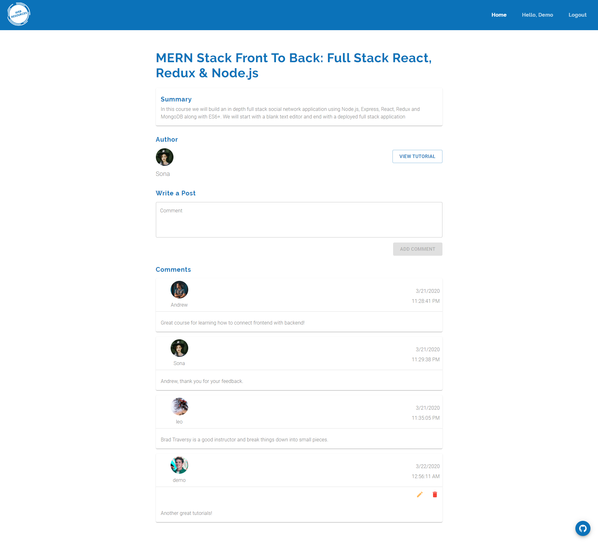

# Welcome to webResources 👋


[](#)

> WebResources is an application that allow users to share their favorite online courses and tutorials for current and new users to expand their knowledges and skills.

### ✨ Client

[Demo](https://webresources.herokuapp.com/)

### 💫 Backend API

[Backend API](https://documenter.getpostman.com/view/9506861/SzS7PR8D?version=latest)

## Short Demo


## Full Demo

[Full Demo Link](https://www.reddit.com/r/webdev/comments/fmudhx/mern_app_for_list_of_tutorials_and_courses_demo/)

## Homepage



## Posts Section



## Comments Section



## Built With

- Node
- React
- Material UI
- Express
- MongoDB
- Mongoose

## Install

Client and Server

```sh
npm install
```

## Usage

Client & Server

```sh
npm run client-prod
```

Client

```sh
npm run start
```

Server

```sh
npm run server
```

## Features

[:heavy_check_mark:] User can register an account

[:heavy_check_mark:] User can login into an account to create resources

[:heavy_check_mark:] User can upload an image

[:heavy_check_mark:] User can get current logged in user

[:heavy_check_mark:] User can update new password

[:heavy_check_mark:] User can create a new post

[:heavy_check_mark:] User can update a post

[:heavy_check_mark:] User can delete a post

[:heavy_check_mark:] User can get all posts

[:heavy_check_mark:] User can get posts by category

[:heavy_check_mark:] User can get post by ID

[:heavy_check_mark:] User can like a post

[:heavy_check_mark:] User can unlike a post

[:heavy_check_mark:] User can create a comment in post

[:heavy_check_mark:] User can get comments by post ID

[:heavy_check_mark:] User can update comment by post ID and comment ID

[:heavy_check_mark:] User can delete comment by post ID and comment ID

[ ] User can follow each other

[ ] User can unfollow each other

[ ] User can view profile

[ ] Many more features coming soon

## Author

👤 **Vuthy Suon**

- Website: https://www.vuthysuon.com/
- Github: [@Suonx002](https://github.com/Suonx002)
- LinkedIn: [@Suonx002](https://linkedin.com/in/Suonx002)

## Show your support

Give a ⭐️ if this project helped you!

---

_This README was generated with ❤️ by [readme-md-generator](https://github.com/kefranabg/readme-md-generator)_
